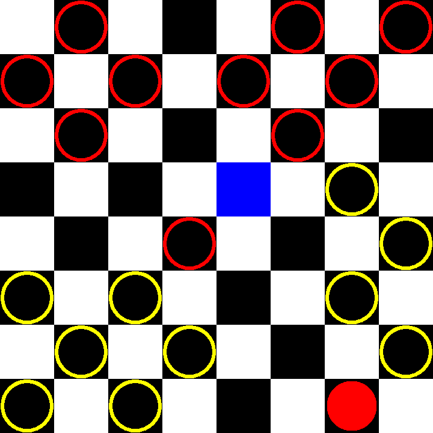

# CheckersBot
[Play against it](https://Btsan.github.io/CheckersBot/)

American Checkers/English Draughts AI

---

A checkers playing agent that heuristically evaluates a given game state with a deep neural network.

The implemented neural network model is a multi-layer perceptron (MLP). The [demo AI](https://Btsan.github.io/CheckersBot/) was initially trained with weakly supervised learning and further trained with reinforcement learning, by playing against itself.

</img>

*Figure: [demo](https://Btsan.github.io/CheckersBot/) being played. AI (red) sacrifices a piece to break the player's formation.*

## Weakly Supervised Learning

The MLP model is initially trained with weakly supervised learning:
<ol>
  <li>Data samples (game states here) are procedurally generated.</li>
  <li>Each sample is heuristically given a <i>weak label</i>. </li>
  <li>Another model, a shallow MLP, evaluates this weakly labeled dataset, <i> evaluating the labeling heurstics</i>. </li>
  <li>The evaluation of the weakly labeled dataset is used to score each weak label as arguably good, or <i>confidence</i>. The higher the generative model's error, the worse the confidence.</li>
  <li>Finally, the actual checkers agent is trained on the labeled dataset, this time <i>weighted by the confidence score for each weak label</i>. This confidence score weights the label of its respective sample.<li>
</ol>

This implementation ~~was quickly made in the hours before it was due in class~~ is a simplified algorithm of its [inspiration](https://arxiv.org/abs/1605.07723).

Because there are so many [possible game states](http://webdocs.cs.ualberta.ca/~chinook/databases/checker_positions.html), the data is generated in *batches*, learned, and then deleted.

Game states are generated from an initial random board state, to diversify training. If all game states were generated from the standard initial board state, the model would likely overfit to heuristics during the early stages of the game. It would also not train well on middle-end game stages.

## Reinforcement Learning

Finally, while the weakly trained model seemed to able to play checkers, it still could't beat ~~me~~ humans. This was likely because my heuristic label was bad, so I had a few options:
<ul>
  <li>Manually readjust the heuristic labeling function(s).</li>
  <li>Programmatically determine an optimal heuristic label, given the individual labeling function components. <i>E.g. genetic algorithms, regression, etc...</i></li>
  <li>Reinforcement learning</li>
</ul>

Manual readjustment of heuristics would be easier if I were a checkers expert. I'm not.

Policy searching algorithms might not have enough dimensions to find a decent gameplay policy in.

Thus, I chose reinforcement learning. The implemented algorithm uses *epsilon-greedy exploration* and rewards actions that lead to a win. Very simple to conceive and implement.

## Result

Interestingly, while my heuristic labels were crafted with a cautious checkers agent in mind, the reinforcment learning program created a more aggressive agent, suggesting that it's bad to be over cautious.

Even so, the reinforcement learning agent could not play very well against ~~me~~ humans, so the [demo](https://Btsan.github.io/CheckersBot/) uses a hard-coded *look-ahead decision algorithm*. This is just a duct tape fix and can be improved...

## Room for Improvements

##### Look-Ahead
The checkers agent, after learning from 10,000 games against itself, performs badly by itself. This may be because it only learned to evaluate the immediate value of a game state and not the long-term value that also considers the opponent's actions.

This issue can be resolved by a look-ahead decision algorithm (such as the hardcoded MinMax algorithm in the [web demo](https://Btsan.github.io/CheckersBot/)) but is time-consuming to calculate. A better solution would be to have the checkers agent train against a MinMax agent, so that it can learn to estimate the long-term MinMax value of game states. This erases the need to have the costly look-ahead algorithm, providng better run-time performance and AI gameplay level.

Also, there are more efficient look-ahead algorithms (read heuristic tree search algorithms)

##### Convolutions
Another possible improvement is the usage of a convolutional neural network, instead of the multi-layer perceptron. However, a CNN separates its weights in filters, unlike the fully connected MLP, so it would be hard to port the trained model into my JavaScript code. 

*disclaimer: there are tools that can easily port a trained model into tensorflow.js, but I'm using copy-paste*

While I think the MLP model actually works quite well (up to a point) and could possibly encode the good responses to all of game states it'd take a large (impossibly so) network very long (impossibly so) to reach that level. A convolutional neural network would generalize the board state and train an agent to achieve a high gameplay level sooner than an MLP agent.

## Tools Used

The model was implemented in [Keras](https://keras.io/), a deep learning library for Python.

The [web demo](https://Btsan.github.io/CheckersBot/) uses [TensorFlow.js](https://js.tensorflow.org/) to run the Keras model.
