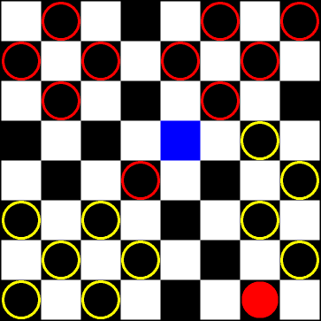

# CheckersBot
[Play against it](https://havorax.github.io/CheckersBot/)

American Checkers/English Draughts AI

---

A checkers playing agent that heuristically evaluates a given game state with a deep neural network.

The implemented neural network model is a multi-layer perceptron (MLP). The [demo AI](https://havorax.github.io/CheckersBot/) was initially trained with weakly supervised learning and further trained with reinforcement learning, by playing against itself.

</img>

*Figure: [demo](https://havorax.github.io/CheckersBot/) being played. AI (red) sacrifices a piece to break the player's formation.*

## Weakly Supervised Learning

The MLP model is initially trained with weakly supervised learning:
<ol>
  <li>Data samples (game states here) are procedurally generated.</li>
  <li>Each sample is heuristically given a <i>weak label</i>. </li>
  <li>Another model, a shallow MLP called the <i>generative model</i>, is trained on this labeled dataset, <i>given the labeling heurstics</i>. </li>
  <li>The error of the generative model, for the labeled dataset, is used to score each weak label as arguably good, or <i>confidence</i>. The higher the generative model's error, the worse the confidence.</li>
  <li>Finally, the actual checkers agent is trained on the labeled dataset, this time <i>given the confidence score for each weak label</i>. This confidence score weights the calculated step, for each sample.<li>
</ol>

This implementation ~~was quickly made for turning in to class, shortly after a couple hours~~ is a simplified algorithm of its [inspiration](https://arxiv.org/abs/1605.07723).

Because there are so many [possible game states](http://webdocs.cs.ualberta.ca/~chinook/databases/checker_positions.html), the data is generated in *batches*, learned, and then deleted. This process could be improved by saving game states (perhaps in a SQL database). The saved game states should be game states that are difficult or significant to the agent's learning process.

Game states are generated from an initial random board state, to diversify training. If all game states were generated from the standard initial board state, the model would likely overfit to heuristics during the early stages of the game. It would also not train well on middle-end game stages.

## Reinforcement Learning

Finally, while the weakly trained model seemed to able to play checkers, it still could't beat ~~me~~ humans. This was likely because my heuristic label was bad, so I had a few options:
<ul>
  <li>Manually adjust the heuristic labeling function(s).</li>
  <li>Programmatically determine an optimal heuristic label, given the individual labeling function components. <i>E.g. genetic algorithms, swarm search, etc...</i></li>
  <li>Reinforcement learning algorithms.</li>
</ul>

Manual adjustment could take a long time and I wouldn't claim to have the checkers expertise to do so confidently.

Policy searching algorithms ~~could~~ very likely would take a long time and there might not be enough search dimensions to find a decent gameplay policy.

Thus, I chose reinforcement learning, in which I would just have the model learn to beat itself, repeatedly improving. The implemented algorithm uses *epsilon-greedy exploration* and rewards the agent for winning and lightly punishes drawing.

## Result

Interestingly, while my heuristic labels were crafted to create a cautious checkers agent, the reinforcment learning program created a more aggressive agent, suggesting that my heuristic labelling function was poorly designed.

Even so, the reinforcement learning agent could not play very well against ~~me~~ humans, ~~so the [demo](https://havorax.github.io/CheckersBot/) uses a hard-coded *look-ahead decision algorithm*. This is just a duct tape fix and can be improved...~~ so I retrained the model. It's still far from amazing, but it has improved a little bit.

## Room for Improvements

##### Look-Ahead
The checkers agent, after learning from 10,000 games against itself, performs badly by itself. This may be because it only learned to evaluate the immediate value of a game state and not the long-term value that also considers the opponent's actions.

This issue can be resolved by a look-ahead decision algorithm (such as the hardcoded MinMax algorithm in the [web demo](https://havorax.github.io/CheckersBot/)) but is time-consuming to calculate. A better solution would be to have the checkers agent train against a MinMax agent, so that it can learn to estimate the long-term MinMax value of game states. This erases the need to have the costly look-ahead algorithm, providng better run-time performance and AI gameplay level.

##### Convolutions
Another *possible* improvement is the usage of a convolutional neural network, instead of the multi-layer perceptron model. I had originally used an MLP, because the model considers the entire board state, without any loss of information. However, an MLP would have to learn the correct response to all possible game states, which are too many to consider. The number of game states also suggests a large number of weights and layers, than actually used in my application.

While I think an MLP model actually works quite well for checkers, and could possibly encode the good responses to all of game states it'd take very long to reach that level. A convolutional neural network would generalize the board state (as well as possible loss of information) and train an agent to achieve a high gameplay level sooner than an MLP agent. 

## Tools Used

The model was implemented in [Keras](https://keras.io/), a deep learning library for Python.

The [web demo](https://havorax.github.io/CheckersBot/) uses [TensorFlow.js](https://js.tensorflow.org/) to run the Keras model.
